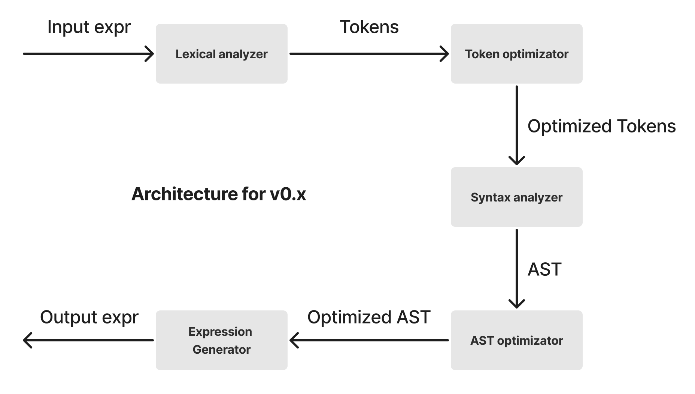

# relt v0.1.0

<b>relt</b> is a <b>re</b>gular <b>l</b>anguage <b>t</b>ranslator is created for optimization and translating different regular languages

## Architecture



## Project Structure
```
.
├── assets
├── lexical_analyzer.py
├── main.py
├── relt
│   ├── ast_optimizator
│   ├── expression_generator
│   ├── lexical_analyzer
│   ├── main.py
│   ├── syntax_analyzer
│   └── token_optimizator
└── syntaxes

```