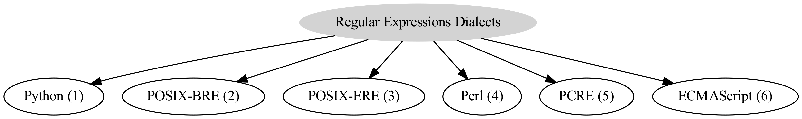
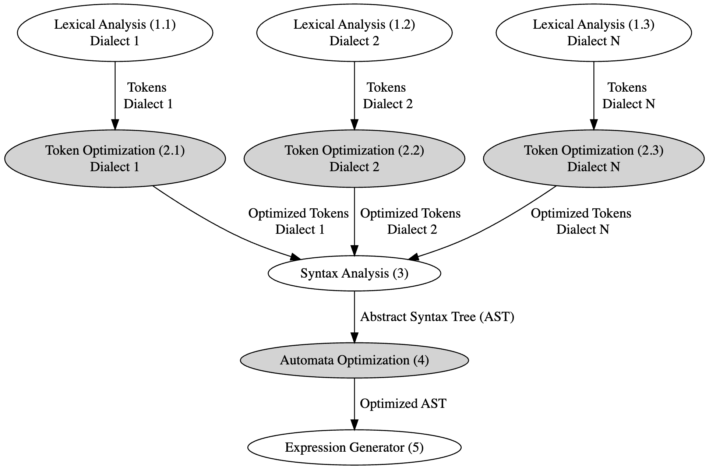

# Regular Expression Translator

# TODO: FIX EXAMPLES

## Dialects

ID-s:
1. python
2. posix-bre
3. posix-ere
4. perl
5. pcre
6. ecmascript



## Workflow



### Lexical analysis

#### input
```python
regex = "ab?c.|[0-9]\["
syntax = "python"
```
#### output
```python
tokens = [
    "1.start_group,0",
    "1.atom,a", 
    "1.atom,b", 
    "1.0_or_1", 
    "1.atom,c",
    "1.any",
    "1.alt",
    "1.start_range,0",
    "1.atom,0",
    "1.atom,-",
    "1.atom,9",
    "1.end_range",
    "1.escape",
    "1.start_range,0",
    "1.end_group,0"
]
```

### Tokens Optimization
will be soon...

### Syntax analysis

#### input
```python
tokens = [
    "1.start_group,0",
    "1.atom,a", 
    "1.atom,b", 
    "1.0_or_1", 
    "1.atom,c",
    "1.any",
    "1.alt",
    "1.start_range,0",
    "1.atom,0",
    "1.atom,-",
    "1.atom,9",
    "1.end_range",
    "1.escape",
    "1.start_range,0",
    "1.end_group,0"
]
```
#### output
```python
ast = (
    "seq", 
    ("atom", "a"),
    ("repeat", ("atom", "b"), 0, 1),
    ("atom", "c"),
    ("alt", ("any", ), ("range", 0, 9)),
    ("escape", "[")
)
```

### AST Optimization
will be soon...

### Expression Generator

#### input
```python
ast = (
    "seq", 
    ("atom", "a"),
    ("repeat", ("atom", "b"), 0, 1),
    ("atom", "c"),
    ("alt", ("any", ), ("range", 0, 9)),
    ("escape", "[")
)
syntax = 'python'
```
#### output
```python
regex = "ab{,1}c.|[0-9]\["
```